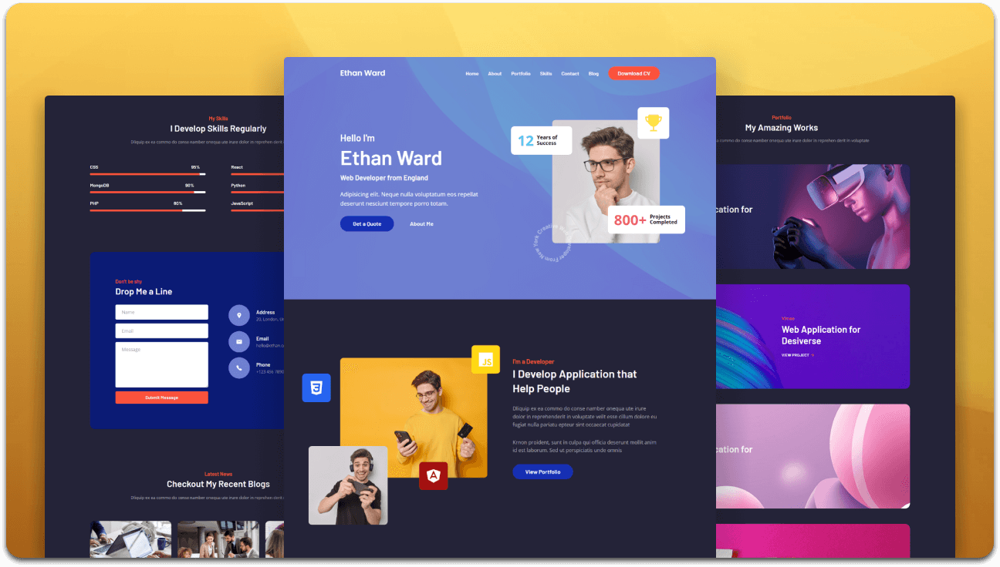

<div align="center">

  
  
  
  [](https://twitter.com/intent/follow?screen_name=YogeshR_)

  <br />
  <br />

  <h2 align="center">Personal Portfolio Website</h2>

  Fully responsive personal portfolio website, <br />Responsive for all devices, built using HTML, CSS, and Bootstrap.

</div>

<br />

### Demo Screenshots



### Prerequisites

Before you begin, ensure you have met the following requirements:

* [Git](https://git-scm.com/downloads "Download Git") must be installed on your operating system.

### Run Locally

To run **Portfolio** locally, run this command on your git bash:

Linux and macOS:

```bash
sudo git clone https://github.com/YogeshR/portfolio.git
```

Windows:

```bash
git clone https://github.com/YogeshR/portfolio.git
```

### Contact

If you want to contact me, you can reach me at [Insta](https://www.instagram.com/yogeoffcl).

### License

This project is **free to use** and does not contain any license.
# Web-development-and-Graphic-DesignPortfolio
